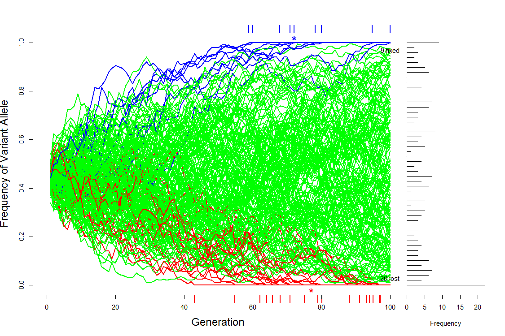

# ShinyPopulationGenetics
Shiny applications for teaching population genetics

|Title                    |                                                 |
|-------------------------|-------------------------------------------------|
|BottleneckSelection      | Selection through a bottleneck                  |   
|SnakeDrift               | Simple Pictoral representation of Genetic Drift |
|SelectionDriftSimulation | Simulation of Drift and Selection               | 

## I have these available at

<http://bgm2058.shinyapps.io/SelectionDriftSimulation>,  
<http://extrabgm2058.shinyapps.io/SelectionDriftSimulation> and   
<http://evolutionncl.shinyapps.io/SelectionDriftSimulation>

## SnakeDrift

Code for simulation of drift in small populations

***

This is a tiny web application that simulates a small population of "Snakes".  See screenshot.

## SelectionDriftSimulation

Simulation of selection and drift in randomly mating populations

***

